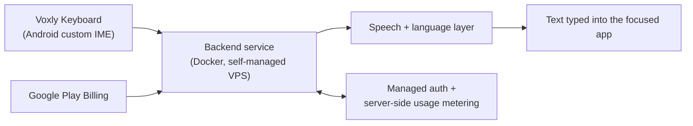
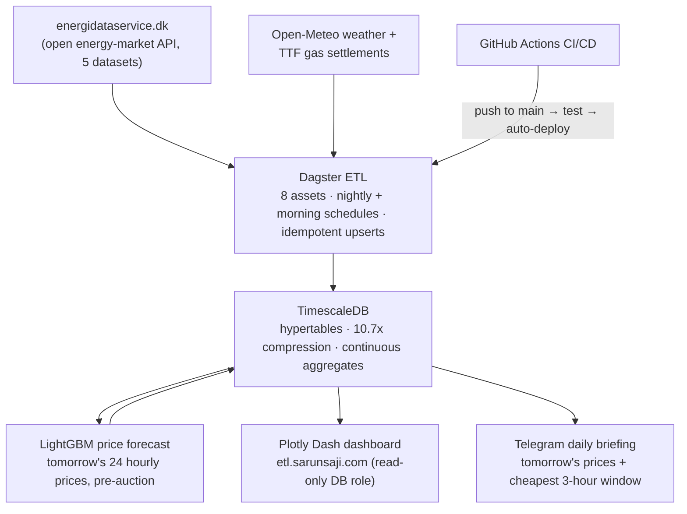
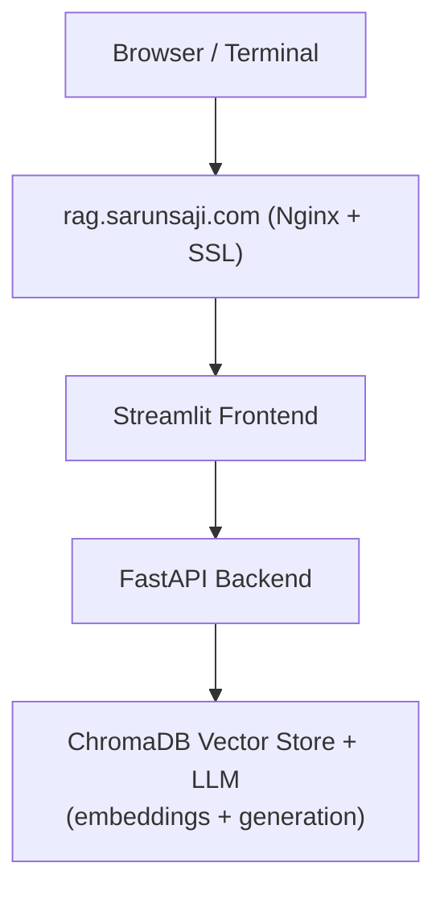

# Hi, I'm Sarun Saji 👋

Software Developer — Backend & AI specializing in Python, Django, FastAPI, and Android Kotlin. Passionate about building AI-integrated mobile experiences and production-grade backend systems.

📍 Aalborg, Denmark | Open to Backend, Mobile AI, and AI Automation roles

---

## 🚀 Featured Project: Voxly AI Keyboard — live on Google Play

**Voxly** is a keyboard you can talk to. Hold the mic, say what you mean, and it types it into whatever app you are already in — WhatsApp, Gmail, Instagram, anything. Speak one language and send another, across **22 languages**, twelve of which get a full keyboard in their own script.

Built end to end by one developer and shipped as a commercial product with in-app purchases.

📲 **[Get it on Google Play](https://play.google.com/store/apps/details?id=com.ss.voxly)** · 🌐 [voxlykeys.com](https://voxlykeys.com)

### Key Features
- **Speak one language, send another**: say it in Malayalam and send it in Danish, or Hindi in and English out. Voxly writes in the language you picked, straight into the focused field.
- **Twelve keyboards in their own script**: Malayalam, Tamil, Hindi, Marathi, Nepali, Bengali, Punjabi, Gujarati, Telugu, Kannada, Arabic and Urdu — every letter on the board, in alphabet order. Danish, Norwegian, Swedish, German and French get their real layouts rather than a long-press menu.
- **A check before you send**: when the output is a language the user cannot read, Voxly shows them what it says in English first.
- **A full keyboard, not a voice add-on**: swipe typing, suggestions that learn the words you actually use, transliteration from Latin letters into script, emoji, GIF search, themes with a live preview, and TalkBack accessibility throughout.
- **Typing is free**: every keyboard, swipe, emoji and GIF costs nothing — only a voice message spends a credit.
- **Purchases that cannot be forged**: the client never grants its own credits. Entitlement is decided server-side and every Play purchase is verified with Google before it is honoured.
- **Privacy as a constraint**: voice recordings are deleted as soon as the text is ready and are never stored; the text Voxly produces is never logged.
- **In-App Updates**: Google Play flexible update flow ships new versions without the user leaving the keyboard.

### Architecture

### Tech Stack

**Mobile (Android)**
- Custom **InputMethodService (IME)** in Kotlin — rendering, touch pipeline, long-press popups and accessibility all written from scratch, because Android's keyboard framework has been deprecated for years
- Jetpack Compose (Material 3) + XML Views
- Real-time audio capture, fully asynchronous — a keyboard can never crash, block the UI thread, or lose the input connection
- Firebase Authentication (ID token)
- OkHttp + Coroutines
- Google Play Billing + in-app updates

**Backend**
- **FastAPI** in Docker, behind Nginx with Let's Encrypt TLS on a self-managed VPS
- Firebase Admin SDK + Firestore for identity and balances
- Server-side usage metering, and purchase verification against the Google Play Developer API

> **A note on detail.** Voxly is a live commercial product, so this section stops at the level above. The model and prompt design, the anti-abuse and entitlement layers, and the transliteration, prediction and swipe-decoding engines are not published. I am glad to go into depth on any of it in conversation.

---

## ⚡ Featured Project: Danish Power Data Pipeline

A **production data platform for the Danish electricity market** — every night it ingests day-ahead prices, wind & solar forecasts, CO₂ intensity, and household consumption for all of Denmark, and serves them as a live analytics dashboard and an automated daily Telegram briefing. Every morning a **machine-learning model predicts the next day's 24 hourly electricity prices before the market auction closes**, and its accuracy is scored publicly on the dashboard as the official prices land. **31.8 million rows spanning 5+ years**, running 24/7 and redeploying itself on every push to `main`.

**Live Dashboard**: [etl.sarunsaji.com](https://etl.sarunsaji.com) | **Code**: [danish-power-data-pipeline](https://github.com/SarunSaji31/danish-power-data-pipeline)

### Engineering Highlights
- **Orchestration (Dagster)**: 8 assets across 3 data providers (energy market, weather, gas) with nightly self-healing re-materialization; the initial 5-year backfill ran as 85 resumable, state-tracked jobs that survived mid-run network failures
- **ML price forecasting (LightGBM)**: predicts tomorrow's 24 hourly DK1 prices each morning **before the 12:00 day-ahead auction** — features are leak-free by construction (price lags, point-in-time weather forecasts, previous gas settlement; the grid operator's own forecast publishes too late and is deliberately excluded). Walk-forward backtest over 24 months: **MAE 0.19 DKK/kWh vs 0.29 for a naive forecast (−32%)**; predictions are stored as immutable receipts keyed to git-versioned model files and scored live on the dashboard
- **Defensive ingestion**: batched windowed fetches against an aggressively rate-limited public API with automatic HTTP 429/network retry; transparently merges the hourly and 15-minute market eras across the October 2025 Nordic settlement switch
- **Idempotent by design**: every row lands via batched upserts (`INSERT … ON CONFLICT DO UPDATE`) — any partition can be safely re-run; recovery from any failure is "run it again"
- **Time-series storage (TimescaleDB)**: hypertables with columnar compression (**6 GB → 563 MB, 10.7×**) and continuous aggregates that cut the heaviest dashboard query from **2,195 ms to 19 ms (116×)**
- **Serving**: Plotly Dash dashboard — KPI tiles, a choropleth map of all 98 Danish municipalities, price heatmaps, market-insight charts — reading only pre-computed aggregates through a **least-privilege read-only DB role**
- **CI/CD (GitHub Actions)**: every push runs the test suite, then SSH-deploys both the pipeline daemon and the dashboard container — zero manual steps

### Architecture

### Stack
| Layer | Technology |
|-------------|-------------------------------------|
| Orchestration | Dagster (partitioned assets, schedules, backfills) |
| Database | TimescaleDB (PostgreSQL) — hypertables, compression, continuous aggregates |
| Machine Learning | LightGBM — leak-free features, walk-forward backtesting, git-versioned models |
| Dashboard | Plotly Dash + Gunicorn |
| Notifications | Telegram Bot API |
| CI/CD | GitHub Actions (test → SSH deploy) |
| Infrastructure | Docker, Nginx + Let's Encrypt, self-managed VPS |

---

## 🧠 Featured Project: Personal RAG System

A self-hosted Retrieval-Augmented Generation (RAG) system running on a self-managed VPS.

**Live at**: https://rag.sarunsaji.com

- Upload PDFs, text, and links into named collections
- Query via clean Streamlit UI or terminal
- **Gemini 2.5 Flash** for grounded answers, **Gemini embeddings** + ChromaDB for retrieval
- Nginx + Let's Encrypt SSL

### Architecture

### Stack
| Layer       | Technology                          |
|-------------|-------------------------------------|
| Frontend    | Streamlit                           |
| Backend     | FastAPI                             |
| Vector DB   | ChromaDB                            |
| LLM         | Gemini 2.5 Flash + gemini-embedding-001 |
| Proxy       | Nginx + Let's Encrypt               |
| Server      | Self-managed VPS (Ubuntu)           |

---

## 🚌 Featured Project: EKSTM — Staff Transport Management System

**EKSTM** is a production-grade Django web application built for **Emirates (EK)** to manage end-to-end staff transport operations across a large fleet.

### Key Features
- **Driver Duty Cards**: Daily trip scheduling and head count submission per driver
- **Fleet & Odometer Tracking**: Bus KM submissions and GPS-integrated mileage reporting
- **OTP & Delay Analytics**: Real-time On-Time Performance dashboards with auto-calculated delay metrics
- **Breakdown Reporting**: Incident reporting with structured data capture
- **STM Route Timetables**: Searchable route → stop → shift-time drill-down with public dashboard
- **Driver Document Profiles**: Google Drive-integrated document storage with OAuth2 and in-app image proxy
- **EKSTM 47-Seater Fleet**: GPS trip data, Salik toll tracking, and mileage dashboards for sub-fleet
- **Role-Based Access**: Strict driver vs. admin separation enforced via custom decorators

### Tech Stack

**Backend**
- **Django** (single `duty/` app, views split by domain: auth, driver, reports, STM, bus, profile, upload)
- **MySQL** (PyMySQL adapter)
- Google Drive API (OAuth2 for driver document storage)

**Frontend**
- Django Templates + Bootstrap 4/5 (main pages)
- Tailwind CSS (dashboard card theming)
- React 18 + Axios (staff ID / driver name autocomplete)
- Vanilla JS `fetch()` calls to JSON API endpoints embedded in templates

**Data Pipelines**
- CSV import management commands for drivers, duty cards, bus master data
- GPS reports, Salik toll, and mileage CSV uploads via UI (`update_or_create` deduplication)
- Cabin crew Excel processing with cluster-based unit count aggregation

**Key Architectural Patterns**
- Domain-split views package (`duty/views/`) — each module fully self-contained
- Custom `admin_required` decorator checking `DriverImportLog` membership
- Google Drive image proxy to bypass browser cross-origin restrictions
- React component scoped only to the autocomplete UX; rest is server-rendered

---

## About Me

I love building systems that bridge **mobile interfaces** with **powerful AI backends**. My focus is on creating delightful, intelligent user experiences powered by modern LLMs, voice AI, and clean architecture.

Core interests:
- AI-powered mobile tools (especially Android)
- Natural voice interfaces
- Self-hosted & private AI systems
- Clean, scalable backend architecture
- Workflow automation

---

## Technical Skills

### Mobile & AI
- **Kotlin** + Android SDK (Custom IME development)
- AI integration: multimodal LLMs, real-time audio pipelines
- Firebase Authentication

### Backend & Languages
- **Python** — FastAPI, Django, Flask
- Pandas (Excel/data processing pipelines)
- JavaScript (integrations)
- PostgreSQL, TimescaleDB, MySQL, Firestore

### AI & ML
- Google Gemini (multimodal)
- ElevenLabs Voice Cloning & TTS
- LangChain, ChromaDB, Ollama
- RAG pipelines, embeddings, local LLMs

### Data Engineering
- **Dagster** (partitioned assets, schedules, resumable backfills)
- **TimescaleDB** (hypertables, columnar compression, continuous aggregates)
- ETL design: idempotent upserts, rate-limit-aware ingestion, UTC-first time handling

### Automation & DevOps
- n8n (automation workflows)
- Docker, Linux, Nginx
- Deployment: self-managed VPS, AWS (EC2, S3), Gunicorn
- **CI/CD**: GitHub Actions pipelines — automated test → Docker build → SSH deploy on push to `main` (actions pinned to commit SHAs for supply-chain safety)
- Git & GitHub

---

## Projects

- **[Danish Power Data Pipeline](https://github.com/SarunSaji31/danish-power-data-pipeline)** — Production energy-market ETL: Dagster + TimescaleDB ingesting 31.8M rows of Danish electricity data, live Plotly Dash analytics + daily Telegram briefing, full CI/CD — [etl.sarunsaji.com](https://etl.sarunsaji.com)
- **Voxly AI Keyboard** — Voice-powered Android keyboard in 22 languages, live on Google Play (Kotlin custom IME + FastAPI + Play Billing) — [Play Store](https://play.google.com/store/apps/details?id=com.ss.voxly) · [voxlykeys.com](https://voxlykeys.com)
- **Personal RAG System** — Self-hosted document Q&A (Gemini + ChromaDB) — [rag.sarunsaji.com](https://rag.sarunsaji.com)
- **Portfolio Site** — Django 6 site with a full **CI/CD pipeline** (GitHub Actions: test → auto-deploy), Docker, and a strict CSP — [sarunsaji.com](https://www.sarunsaji.com)
- **EKSTM** — Django-based Staff Transport Management System for Emirates (duty cards, OTP analytics, fleet tracking, Google Drive document profiles)
- **[Cabin Crew Trips Automation](https://github.com/SarunSaji31/cabincrew_trips_automation)** — Django + Pandas system that turns raw inbound/outbound crew Excel files into grouped, rule-based trip reports
- **[Aalborg DK1 Energy Dashboard](https://dash.sarunsaji.com)** — End-to-end energy-market data platform for Denmark's DK1 zone: a scheduled **n8n** pipeline ingests day-ahead electricity prices and wind forecasts from Energinet's official API into **PostgreSQL**, surfaced through a live **Plotly Dash** dashboard and automated **Telegram** briefings — containerised (Docker) and continuously deployed via **GitHub Actions CI/CD** — [dash.sarunsaji.com](https://dash.sarunsaji.com)
- **n8n Recovery & Backup Systems** — Automated infrastructure reliability protocols

---

## Career Focus

Actively seeking opportunities as:

- **Backend Developer** (Python / FastAPI / Django)
- **Data Engineer** (Python / Dagster / TimescaleDB / SQL)
- **Mobile AI Developer** (Android / Kotlin + AI)
- **AI Systems Engineer** (Voice AI, RAG, LLM applications)
- **Automation & Operations Engineer**

---

## Contact

📧 Personal: sarunsaji31@gmail.com  
📧 Work: info@sarunsaji.com  
🌐 Portfolio: https://www.sarunsaji.com  
🔗 LinkedIn: https://www.linkedin.com/in/sarun-saji-523b54169
