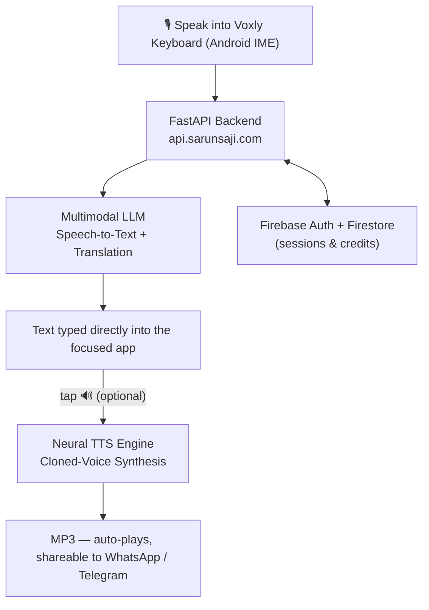
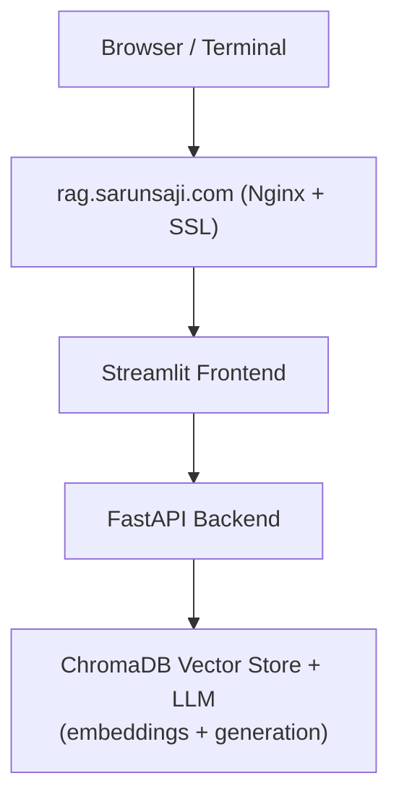

# Hi, I'm Sarun Saji 👋

Software Developer — Backend & AI specializing in Python, Django, FastAPI, and Android Kotlin. Passionate about building AI-integrated mobile experiences and production-grade backend systems.

📍 Aalborg, Denmark | Open to Backend, Mobile AI, and AI Automation roles

---

## 🚀 Featured Project: Voxly AI Voice Keyboard

**Voxly** is an intelligent voice-powered AI keyboard for Android that lets you **speak naturally** and get real-time transcription + translation, powered by your **own cloned voice**.

### Key Features
- **Voice Typing with Translation**: Speak in any supported language → instant transcription + translation to English (or target language) directly into any app.
- **Personal Voice Cloning**: Clone your voice using ElevenLabs and hear your messages spoken back in **your own voice**.
- **Per-Voice Tuning**: Adjust speed, stability, similarity, and style for each cloned voice — every voice keeps its own settings.
- **Multilingual TTS**: Generate natural, casual spoken audio in 20+ languages (including colloquial Tamil, Hinglish-style Hindi, etc.).
- **Send Voice Messages**: Share cloned-voice audio to WhatsApp, Telegram, or any app via the system share sheet.
- **Custom Keyboard Engine**: Canvas-rendered QWERTY/symbols keyboard with word predictions, autocorrect, emoji panel, and TalkBack accessibility.
- **Transcription Styles**: One-tap toggle between faithful English output and casual Gen Z texting style.
- **Credit System**: Freemium model with Firebase Auth — 50 free credits on signup, atomic deductions, charged only on successful results.
- **In-App Updates**: Google Play flexible update flow prompts users when a new version ships.

### Architecture

### Tech Stack

**Mobile (Android)**
- Custom **InputMethodService (IME)** in Kotlin
- Custom canvas keyboard view with prediction + autocorrect over a 40k-word dictionary
- Jetpack Compose (Material 3) + XML Views
- Real-time audio recording with MediaRecorder + layered silence detection (no wasted API calls or credits)
- Firebase Authentication (ID Token)
- OkHttp + Coroutines for backend communication

**Backend (FastAPI)**
- **Gemini (Google)** for speech-to-text and natural language translation
- **ElevenLabs** for high-quality voice cloning and turbo TTS
- Firebase Admin SDK + Firestore (user credits & profiles)
- Credit deduction system (1 credit for translation, 3 for voice generation) — atomic Firestore transactions, charged only on success
- Voice profile management (upload samples → clone → tune → reuse, with slot-safe deletion)

**Supported Languages** (Transcription + Natural TTS)
English, Chinese, Japanese, Korean, German, French, Russian, Spanish, Portuguese, Italian, Hindi, Arabic, Tamil, and many more.

**Live Backend**: `https://api.sarunsaji.com`

---

## 🧠 Featured Project: Personal RAG System

A self-hosted Retrieval-Augmented Generation (RAG) system running on a Hetzner VPS.

**Live at**: https://rag.sarunsaji.com

- Upload PDFs, text, and links into named collections
- Query via clean Streamlit UI or terminal
- **Gemini 2.5 Flash** for grounded answers, **Gemini embeddings** + ChromaDB for retrieval
- Nginx + Let's Encrypt SSL

### Architecture

### Stack
| Layer       | Technology                          |
|-------------|-------------------------------------|
| Frontend    | Streamlit                           |
| Backend     | FastAPI                             |
| Vector DB   | ChromaDB                            |
| LLM         | Gemini 2.5 Flash + gemini-embedding-001 |
| Proxy       | Nginx + Let's Encrypt               |
| Server      | Hetzner VPS (Ubuntu)                |

---

## 🚌 Featured Project: EKSTM — Staff Transport Management System

**EKSTM** is a production-grade Django web application built for **Emirates (EK)** to manage end-to-end staff transport operations across a large fleet.

### Key Features
- **Driver Duty Cards**: Daily trip scheduling and head count submission per driver
- **Fleet & Odometer Tracking**: Bus KM submissions and GPS-integrated mileage reporting
- **OTP & Delay Analytics**: Real-time On-Time Performance dashboards with auto-calculated delay metrics
- **Breakdown Reporting**: Incident reporting with structured data capture
- **STM Route Timetables**: Searchable route → stop → shift-time drill-down with public dashboard
- **Driver Document Profiles**: Google Drive-integrated document storage with OAuth2 and in-app image proxy
- **EKSTM 47-Seater Fleet**: GPS trip data, Salik toll tracking, and mileage dashboards for sub-fleet
- **Role-Based Access**: Strict driver vs. admin separation enforced via custom decorators

### Tech Stack

**Backend**
- **Django** (single `duty/` app, views split by domain: auth, driver, reports, STM, bus, profile, upload)
- **MySQL** (PyMySQL adapter)
- Google Drive API (OAuth2 for driver document storage)

**Frontend**
- Django Templates + Bootstrap 4/5 (main pages)
- Tailwind CSS (dashboard card theming)
- React 18 + Axios (staff ID / driver name autocomplete)
- Vanilla JS `fetch()` calls to JSON API endpoints embedded in templates

**Data Pipelines**
- CSV import management commands for drivers, duty cards, bus master data
- GPS reports, Salik toll, and mileage CSV uploads via UI (`update_or_create` deduplication)
- Cabin crew Excel processing with cluster-based unit count aggregation

**Key Architectural Patterns**
- Domain-split views package (`duty/views/`) — each module fully self-contained
- Custom `admin_required` decorator checking `DriverImportLog` membership
- Google Drive image proxy to bypass browser cross-origin restrictions
- React component scoped only to the autocomplete UX; rest is server-rendered

---

## About Me

I love building systems that bridge **mobile interfaces** with **powerful AI backends**. My focus is on creating delightful, intelligent user experiences powered by modern LLMs, voice AI, and clean architecture.

Core interests:
- AI-powered mobile tools (especially Android)
- Natural voice interfaces and voice cloning
- Self-hosted & private AI systems
- Clean, scalable backend architecture
- Workflow automation

---

## Technical Skills

### Mobile & AI
- **Kotlin** + Android SDK (Custom IME development)
- AI Integration: Gemini, ElevenLabs, real-time audio pipelines
- Firebase Authentication

### Backend & Languages
- **Python** — FastAPI, Django, Flask
- Pandas (Excel/data processing pipelines)
- JavaScript (integrations)
- PostgreSQL, MySQL, Firestore

### AI & ML
- Google Gemini (multimodal)
- ElevenLabs Voice Cloning & TTS
- LangChain, ChromaDB, Ollama
- RAG pipelines, embeddings, local LLMs

### Automation & DevOps
- n8n (automation workflows)
- Docker, Linux, Nginx
- Deployment: Hetzner, AWS (EC2, S3), Gunicorn
- **CI/CD**: GitHub Actions pipelines — automated test → Docker build → SSH deploy on push to `main` (actions pinned to commit SHAs for supply-chain safety)
- Git & GitHub

---

## Projects

- **Voxly AI Voice Keyboard** — Voice-to-text + personal voice cloning keyboard (Kotlin + FastAPI + Gemini + ElevenLabs)
- **Personal RAG System** — Self-hosted document Q&A (Gemini + ChromaDB) — [rag.sarunsaji.com](https://rag.sarunsaji.com)
- **Portfolio Site** — Django 6 site with a full **CI/CD pipeline** (GitHub Actions: test → auto-deploy), Docker, strict CSP, and self-hosted analytics — [sarunsaji.com](https://www.sarunsaji.com)
- **EKSTM** — Django-based Staff Transport Management System for Emirates (duty cards, OTP analytics, fleet tracking, Google Drive document profiles)
- **[Cabin Crew Trips Automation](https://github.com/SarunSaji31/cabincrew_trips_automation)** — Django + Pandas system that turns raw inbound/outbound crew Excel files into grouped, rule-based trip reports
- **[UniFi Captive Portal](https://github.com/SarunSaji31/unifi-captive-portal)** — Dockerized Flask + MySQL guest-WiFi portal that captures emails and authorizes devices via the UniFi controller API
- **Aalborg Wind/Price Data Pipeline** — Real-time data ingestion and automation
- **n8n Recovery & Backup Systems** — Automated infrastructure reliability protocols

---

## Career Focus

Actively seeking opportunities as:

- **Backend Developer** (Python / FastAPI / Django)
- **Mobile AI Developer** (Android / Kotlin + AI)
- **AI Systems Engineer** (Voice AI, RAG, LLM applications)
- **Automation & Operations Engineer**

---

## Contact

📧 Personal: sarunsaji31@gmail.com  
📧 Work: info@sarunsaji.com  
🌐 Portfolio: https://www.sarunsaji.com  
🔗 LinkedIn: https://www.linkedin.com/in/sarun-saji-523b54169
